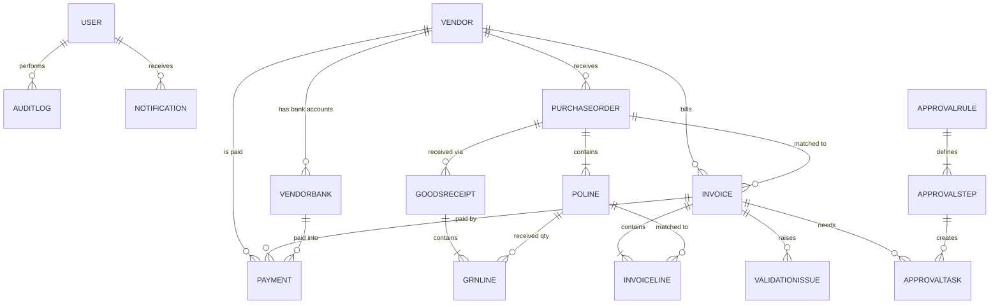

# Entity-Relationship Diagram

```mermaid
erDiagram
    USER ||--o{ AUDITLOG : performs
    USER ||--o{ NOTIFICATION : receives
    VENDOR ||--o{ VENDORBANK : "has bank accounts"
    VENDOR ||--o{ PURCHASEORDER : receives
    VENDOR ||--o{ INVOICE : bills
    VENDOR ||--o{ PAYMENT : "is paid"
    PURCHASEORDER ||--|{ POLINE : contains
    PURCHASEORDER ||--o{ GOODSRECEIPT : "received via"
    GOODSRECEIPT ||--|{ GRNLINE : contains
    POLINE ||--o{ GRNLINE : "received qty"
    PURCHASEORDER ||--o{ INVOICE : "matched to"
    INVOICE ||--|{ INVOICELINE : contains
    POLINE ||--o{ INVOICELINE : "matched to"
    INVOICE ||--o{ VALIDATIONISSUE : raises
    INVOICE ||--o{ APPROVALTASK : needs
    APPROVALRULE ||--|{ APPROVALSTEP : defines
    APPROVALSTEP ||--o{ APPROVALTASK : creates
    INVOICE ||--o{ PAYMENT : "paid by"
    VENDORBANK ||--o{ PAYMENT : "paid into"
```

Full DDL: [`schema.sql`](schema.sql). Regenerate with `python manage.py export_schema ../docs/schema.sql`.
